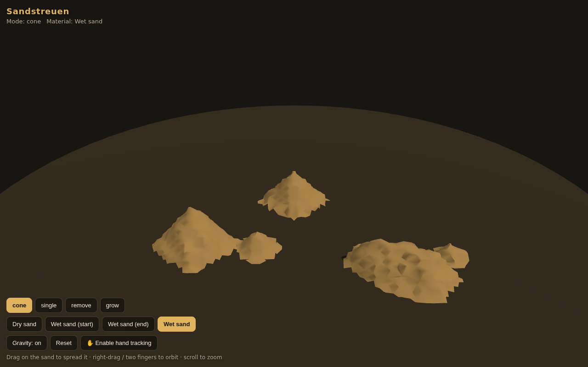

# Sandstreuen

Sculpt piles of sand with your hands. Sand is modelled as a signed distance
field on a voxel grid, meshed with [dual contouring](http://www.boristhebrave.com/2018/04/15/dual-contouring-tutorial/)
and animated with a simple cellular gravity simulation.

The project has been **rebuilt as a modern web app** (TypeScript + Three.js +
MediaPipe hand tracking) in [`web/`](web/). The original Unity 2021 / Manomotion
AR prototype is kept below as a legacy reference.



## Web rebuild

Runs in any modern browser — desktop or phone — with no proprietary SDK.

```bash
cd web
npm install
npm run dev    # local dev server
npm test       # unit tests for the voxel core
npm run build  # static site in web/dist, deployable anywhere
```

### Controls

| Input | Action |
| --- | --- |
| Left-drag / one finger on the sand | spread sand (current edit mode) |
| Right-drag / two fingers | orbit camera |
| Scroll / pinch | zoom |
| ✋ **pinch** (hand tracking) | spread sand at your fingertip |
| ✊ **fist** (hand tracking) | next material |
| 🖐 **open palm** (hand tracking) | next edit mode |

Hand tracking is opt-in (camera permission) and uses MediaPipe's gesture
recognizer — the modern replacement for the discontinued Manomotion CE SDK
the original prototype was built on.

### Edit modes and materials

Like the original: **cone**, **single**, **remove**, **grow** edit modes, and
four sand materials — *sandDry, sandWetStart, sandWetEnd, sandWet* — whose
angle of repose controls how steep deposited cones are (wet sand piles
steeper). The grid **resolution** can be tuned with a URL parameter, e.g.
`?size=96` (32 or higher, default 64; there is no upper limit, but the grid
and the per-frame gravity scan grow with the cube of the resolution, so very
large values get expensive). The sandbox keeps a fixed physical size and the
brushes a fixed physical scale; a higher value only subdivides the volume more
finely, for sharper, more detailed sand.

### What was modernized

- **Unity 2021 + Manomotion CE (discontinued) → TypeScript, Three.js, Vite,
  MediaPipe** — no licenses, no app install, works on any device.
- **Voxel core rewritten as pure modules** (`web/src/core/`) backed by flat
  `Float32Array`s instead of managed 3D arrays, covered by unit tests (Vitest).
- **Performance**: the original remeshed the entire 80³ grid every frame; the
  rebuild recomputes adaptive vertices only inside the dirty region of an edit
  or gravity step and rebuilds the mesh only when something changed.
- **Correctness**: dual-contouring vertex relaxation now uses the actual field
  gradient (the original approximated normals from the brush cone), depositing
  a cone is a proper SDF union (placing new sand can no longer erase old sand),
  and gravity topples piles symmetrically instead of drifting towards +x.
- **Camera/joystick UI → OrbitControls** with touch support.

---

## Legacy: mobile AR prototype (Unity)

A mobile AR isosurface manipulation prototype using
[Manomotion CE](https://www.manomotion.com/) hand tracking. This is very much
an unfinished project to experiment with. The goal was to simulate spreading
sand in some way.

The voxel algorithm is based on dual contouring, generally an implementation of
[Boris The Brave's tutorial](http://www.boristhebrave.com/2018/04/15/dual-contouring-tutorial/)
with some modifications. Built with Unity 2021.1.14f1, tested on a OnePlus 5.

There are 2 settings that can be changed by gestures, the material and the
edit mode. The settings can be seen in the images in small white text.

**Materials** (they influence the angle of the cone):
sanddry, sandwetstart, sandwetend, sandwet

**Edit modes:** cone, single, remove, grow

The camera view is changed by the direction the hand moves towards, but this
can be annoying — that's why there is the button which toggles this feature.
With the controllers the camera can be controlled more easily.

### Demo of the single mode

The scale of 0.1 was used

https://user-images.githubusercontent.com/7975579/155970278-de06a796-0ab4-4e46-bcf0-39eac89f5343.mp4

### Change material by fist gesture


### Create sand by click gesture

<div>
  
  
  
</div>

### Change edit mode by palm switch

<div>
  
  
  
  
</div>
